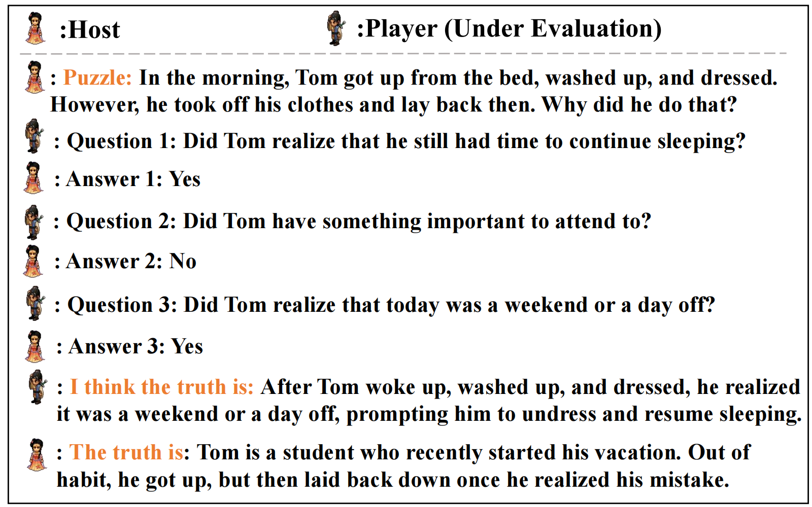

# LatEval: An Interactive LLMs Evaluation Benchmark with Incomplete Information from Lateral Thinking Puzzles

This is the official introduction to the paper [LatEval: An Interactive LLMs Evaluation Benchmark with Incomplete Information from Lateral Thinking Puzzles](https://arxiv.org/pdf/2308.10855.pdf). 

We propose an evaluation benchmark LatEval, which assesses the model’s lateral thinking within an interactive framework.

Our benchmark includes:

(1) 500 Lateral Thinking Puzzles data in English and Chinese.

(2) Metrics for evaluating *the quality of questions posed by the model* and *the model’s capability to integrate information for problem-solving*.

Data and code are coming soon.

